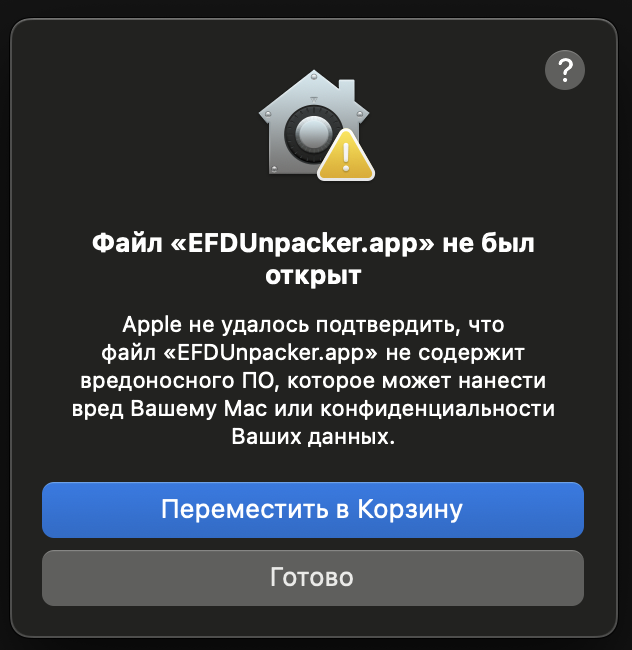
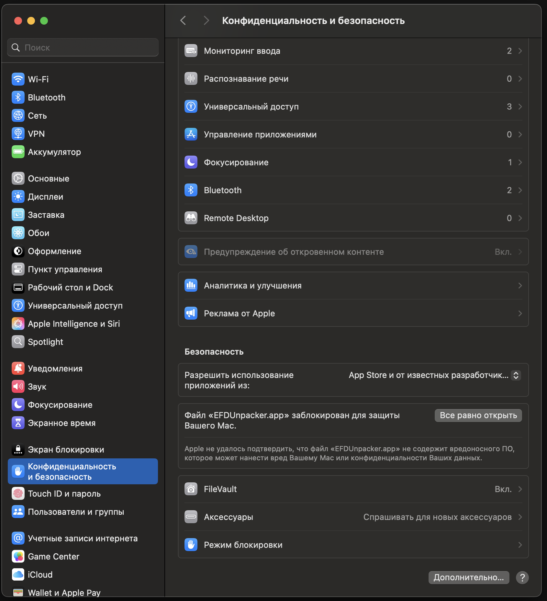
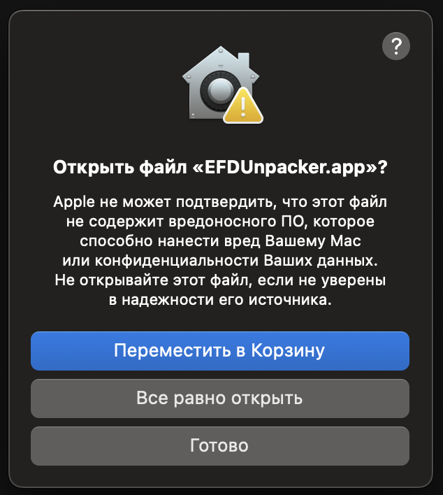

# Установка EFD Unpacker

Инструкция по установке EFD Unpacker на разные операционные системы.

## 📥 Скачать

[Скачайте последний релиз](https://github.com/IngvarConsulting/efd_unpacker/releases)

## 🔧 Системные требования

- **macOS**: 10.15 (Catalina) или новее
- **Windows**: Windows 10 или новее
- **Linux**: Ubuntu 20.04+, CentOS 8+, или совместимые дистрибутивы
- **Python**: 3.9+ (для сборки из исходников)

## 📦 Доступные форматы

- **macOS**: `.app` (приложение), `.dmg` (установщик), `.zip` (portable)
- **Windows**: `.exe` (portable), `.msi` (установщик), `.zip` (portable)
- **Linux**: `.AppImage` (portable), `.deb` (Ubuntu/Debian), `.rpm` (CentOS/RHEL), `.zip` (portable)

---

## 🍎 macOS

### Установка через DMG (рекомендуется)

1. Скачайте файл `.dmg` из релиза
2. Дважды кликните по `.dmg` файлу для монтирования
3. Перетащите `EFD Unpacker.app` в папку "Applications"
4. Извлеките `.dmg` из Finder

### Первый запуск (для всех вариантов)

**Если приложение заблокировано Gatekeeper:**

1. **Первый запуск:**

 - Кликните правой кнопкой мыши по `EFDUnpacker.app` → выберите `Открыть`.
 - В появившемся окне подтвердите запуск (кнопка "Открыть").
 - Если появится сообщение "Приложение не может быть открыто, так как оно не проверено", нажмите "Готово".
  


2. **Откройте "Системные настройки" → "Конфиденциальность и безопасность"**.
   

    

- Внизу окна появится сообщение о блокировке приложения. Нажмите "Все равно открыть"
  

    
- Подтвердите действие
  


3. После этого приложение будет запускаться обычным двойным кликом.

### Portable версия

1. Скачайте `.zip` архив
2. Распакуйте в любую папку
3. Запустите `EFDUnpacker.app` из распакованной папки

---

## 🪟 Windows

### Установка через MSI (рекомендуется)

1. Скачайте файл `.msi` из релиза
2. Дважды кликните по `.msi` файлу
3. Следуйте инструкциям установщика
4. Приложение будет установлено в `Program Files` и добавлено в меню "Пуск"

### Portable версия

1. Скачайте `.zip` архив или `.exe` файл
2. Распакуйте `.zip` в любую папку (или используйте `.exe` напрямую)
3. Запустите `EFDUnpacker.exe`

### Первый запуск

**Если Windows SmartScreen блокирует запуск:**

1. Кликните правой кнопкой мыши по `EFDUnpacker.exe` → выберите "Запуск от имени администратора" (если требуется доступ к системным папкам).
2. Если появится окно "Windows защитил ваш компьютер", нажмите "Подробнее", затем "Выполнить в любом случае".
3. В диалоге "Защитник Windows" нажмите "Запустить в любом случае"

### Запуск от имени администратора

Для доступа к системным папкам или установки ассоциаций файлов:
- Кликните правой кнопкой мыши по `EFDUnpacker.exe`
- Выберите "Запуск от имени администратора"

---

## 🐧 Linux

### AppImage (рекомендуется)

1. Скачайте файл `.AppImage` из релиза
2. Сделайте файл исполняемым: `chmod +x efd-unpacker-*.AppImage`
3. Запустите: `./efd-unpacker-*.AppImage`

### Установка через пакетный менеджер

#### Ubuntu/Debian (.deb)
```bash
sudo dpkg -i efd-unpacker-*.deb
sudo apt-get install -f  # если есть зависимости
```

#### CentOS/RHEL/Fedora (.rpm)
```bash
sudo rpm -i efd-unpacker-*.rpm
# или
sudo dnf install efd-unpacker-*.rpm
```

### Portable версия

1. Скачайте `.zip` архив
2. Распакуйте: `unzip efd-unpacker-*.zip`
3. Запустите: `./efd-unpacker`

### Первый запуск

**Если система блокирует запуск:**

- **AppArmor**: `sudo aa-complain EFDUnpacker`
- **SELinux**: `sudo setsebool -P domain_can_exec_anon_write 1`
- **Права доступа**: `chmod +x EFDUnpacker`

---

## 🔧 Сборка из исходников

### Требования

- Python 3.9+
- PyQt6
- PyInstaller (для сборки)

### Установка

```bash
git clone https://github.com/IngvarConsulting/efd_unpacker.git
cd efd_unpacker
pip install -r requirements.txt
python main.py
```

### Сборка

```bash
# macOS
./build_macos.sh

# Linux
./build_linux.sh

# Windows
./build_windows.ps1
```

---

## ❓ Устранение неполадок

### Общие проблемы

**Если система блокирует запуск** (macOS Gatekeeper, Windows SmartScreen, Linux AppArmor/SELinux), ищите опцию "Выполнить в любом случае" или "Разрешить запуск".

### macOS
- **"App is damaged"**: Выполните `xattr -cr /path/to/EFDUnpacker.app`
- **Gatekeeper блокирует**: См. раздел "Первый запуск" выше

### Windows
- **SmartScreen блокирует**: Добавьте исключение в Защитник Windows
- **"Access denied"**: Запустите от имени администратора

### Linux
- **"Permission denied"**: `chmod +x EFDUnpacker`
- **"Library not found"**: Установите зависимости Qt: `sudo apt install libqt6core6 libqt6gui6 libqt6widgets6`

---

## 📚 Дополнительная информация

- **CLI использование**: см. [CLI.md](CLI.md)
- **Интеграция с PATH**: см. раздел "Интеграция с PATH" в [CLI.md](CLI.md)
- **Ассоциация файлов**: см. [FILE_ASSOCIATION_GUIDE.md](FILE_ASSOCIATION_GUIDE.md)
- **Сборка**: см. [BUILD.md](BUILD.md) 