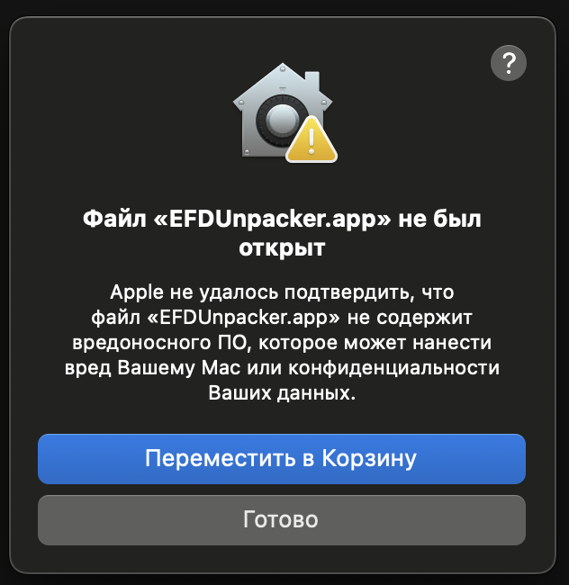
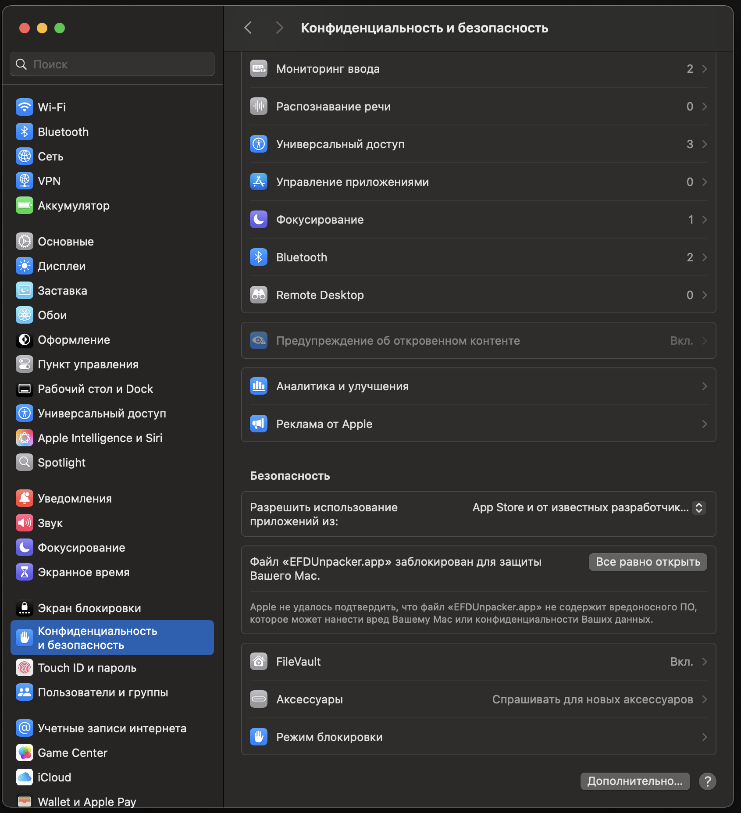
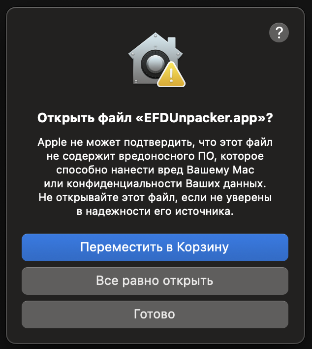
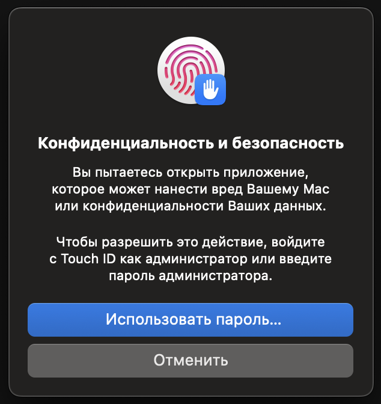

# Установка EFD Unpacker

Инструкция по установке официальных релизных артефактов.

## Скачать

[Открыть страницу релизов](https://github.com/IngvarConsulting/efd_unpacker/releases)

## Что публикуется

- **macOS**: `.dmg`
- **Windows**: `setup.exe`
- **Linux**: `.AppImage`, `.deb`

Приложение по умолчанию стартует на английском языке. Если системная локаль русская, интерфейс и сообщения приложения переключаются на русский.

## macOS

### Установка через DMG

1. Скачайте `.dmg`.
2. Откройте образ.
3. Перетащите `EFDUnpacker.app` в `Applications`.
4. Извлеките образ.
5. Один раз запустите приложение из `Applications`, чтобы команда `efd_unpacker` автоматически зарегистрировалась в пользовательском `PATH`.

После удаления `EFDUnpacker.app` новая shell-сессия больше не будет добавлять эту команду в `PATH`.

### Первый запуск

Если Gatekeeper блокирует приложение:

1. Кликните правой кнопкой по `EFDUnpacker.app` и выберите `Открыть`.
2. Подтвердите запуск.
3. При необходимости разрешите запуск в системных настройках безопасности.






## Windows

### Установка через setup.exe

1. Скачайте `setup.exe`.
2. Запустите установщик.
3. Следуйте шагам мастера установки.
4. Установщик автоматически выберет английский язык по умолчанию и русский на системах с русской локалью.

### Первый запуск

Если SmartScreen блокирует файл:

1. Нажмите `Подробнее`.
2. Выберите `Выполнить в любом случае`.

## Linux

### AppImage

Подходит для быстрого запуска без системной установки.

```bash
chmod +x efd-unpacker-*.AppImage
./efd-unpacker-*.AppImage
```

После первого запуска команда `efd_unpacker` автоматически регистрируется в пользовательском `PATH`. Если терминал уже был открыт, начните новую сессию. После удаления или перемещения `AppImage` новая shell-сессия больше не будет добавлять эту команду в `PATH`.

### DEB

Подходит для Debian/Ubuntu и производных.

```bash
sudo dpkg -i efd-unpacker-*.deb
sudo apt-get install -f
```

После установки бинарь доступен как `efd_unpacker`.

## Сборка из исходников

```bash
git clone https://github.com/IngvarConsulting/efd_unpacker.git
cd efd_unpacker
python -m pip install -r requirements.txt
python main.py
```

Для сборки пакетов см. [BUILD.md](BUILD.md).

## Устранение неполадок

### macOS
- `App is damaged`: `xattr -cr /path/to/EFDUnpacker.app`
- Приложение не открывается: проверьте настройки Gatekeeper

### Windows
- SmartScreen блокирует запуск: разрешите выполнение вручную
- `Access denied`: попробуйте запуск с повышенными правами

### Linux
- `Permission denied` для AppImage: проверьте `chmod +x`
- Проблемы с GUI-зависимостями: установите системные библиотеки Qt

## См. также
- [CLI.md](CLI.md) — режимы командной строки
- [FILE_ASSOCIATION_GUIDE.md](FILE_ASSOCIATION_GUIDE.md) — файловые ассоциации
- [BUILD.md](BUILD.md) — сборка и релизы
